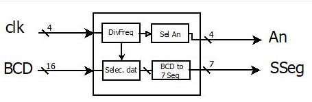
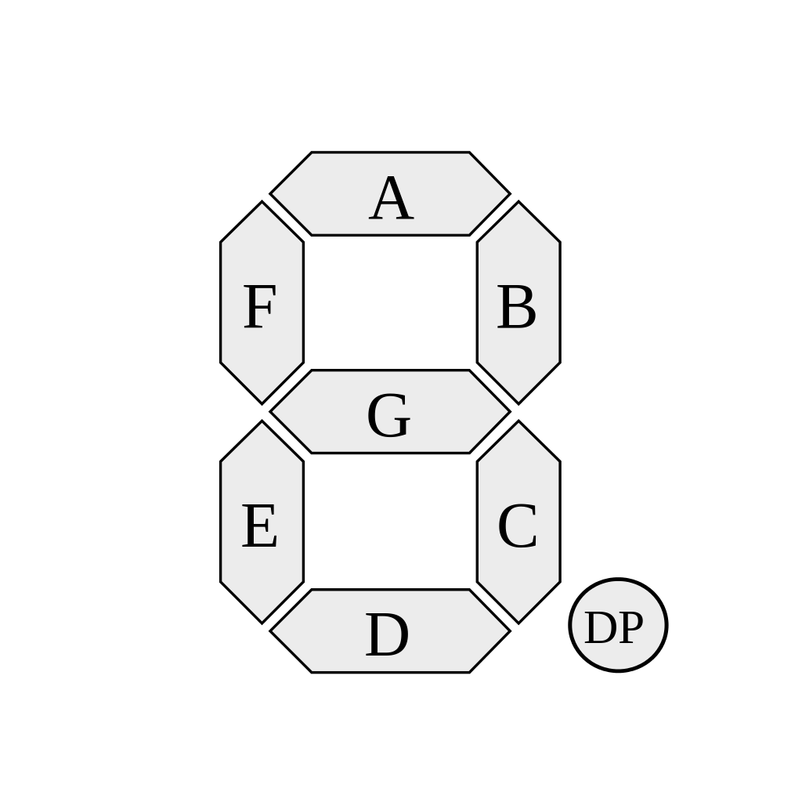
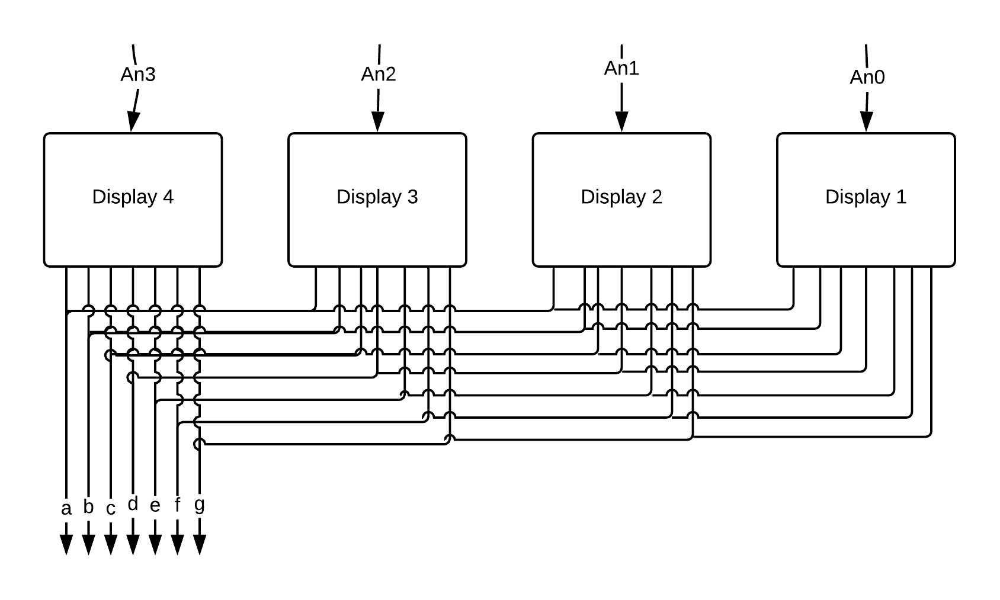
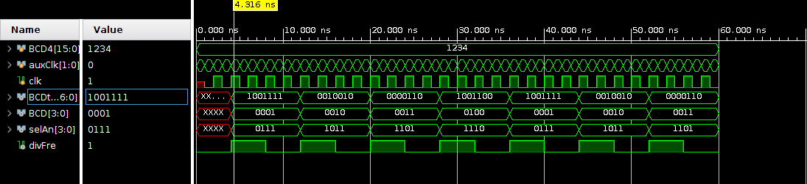

# lab01- BCD2SSEG
laboratorio 02 implementación

* Humberto Sebastián Córrdoba Torres
* Nikolai Alexander Caceres Penagos
* Esteban Ladino Fajardo

Los módulos fueron realizados según las especificaciones que dió el profesosr según se puede observar en el diagrama estructural.  

## Módulo BCD to 7 Seg
 
En primer lugar se procede a diseñar un modulo que permita dado un numero en binario encender los respectivos leds correspondientes al display 7seg. Con este objetivo en mente, se declara un modulo "module BCDtoSeg" con las entradas BCD, numero en binario de 4 bits y por tal definido como [3:0], y divFre, el cual representa la frecuencia que permite desarrollar una visualizacion dinamica de 4 display; y con la salidas Sseg, numero de 7 bits que representa el estado de los leds en el display.

Se desarrolla un ciclo a traves de la funcion "always @ (*)" dentro del cual se lee cada uno de los casos posibles de entradas binarias y se asigna su correspondiente salida. Como dato curioso, en un principio se coloca en lugar del **always @(*)** el  **always @(posedge clk)** y aunque los resultados presentados con tal codigo son correctos, la asignación de los valores aparece desfasada. Para el caso del numero 0 se presenta la siguiente estructura:

 4'b0000: sevSeg <= 7'b0000001; // "0";
 
Donde una vez se entre al caso BCD=0, es decir, el numero de 4 bits en base binaria 0000, se asigna a la variable de salida sevSeg el valor de 7 bits 0000001 que representa que todos los leds estan encendidos (0, pues el display maneja logica inversa) a excepcion del led en la posicion G.

El codigo respectivo a este modulo se encuentra en el archivo BCDtoSeg.V.

## Modulo DivFreq

Sucesivamente se desarrolla el modulo respectivo al divisor de frecuencia, que le permite al programa principal alternar la visualizacion de cada uno de los 4 displays cada cierto tiempo, de manera que la percepcion humana vea todos los displays encendidos al mismo tiempo. Para tal fin, se procede a desarrollar el modulo "module mfreDiv" con la entrada del reloj y la salida del registro del divisor de frecuencia "freeDiv", la cual se inicializa en 0. 

En principio, se define un registro de 27 bits nombrado "conFre" y se inicializa con un uno. Este registro tiene tal cantidad de bits de modo que se pueda guardar en el un número del orden de 134.2xE6 base 10. Posteriormente se hace un ciclo "always @(posedge clk)" en el cual, una vez se presente un flanco de subida se verifique si conFree es igual a 2 o no, en el caso de que se presente la iguldad la frecuencia de salida pasara de ser 0 a ser 1 y la variable interna conFre se reinicia en 0. De darse o no la igualdad, a lo que halla en conFre se le suma 1. Con este pedazo de codigo se consigue que cada 4 ciclos del reloj clk se genere un ciclo del divisor de frecuencia. De querer obtenerse otra frecuencia de salida se debe cambiarse el valor de 2 por el valor requerido. En nuestro caso, la FPGA del laboratorio tiene un reloj (clk) de 100MHz y si se necesita un divisor de frecuencia de 1Hz se hace necesario que **conFre** llegue hasta 50E6 base 10 lo cual puede darse en un registro de 27 bits.

El código implementado se encuentra en el archivo freDiv.v.

## Módulo selAn

Otro modulo pendiente corresponde a el del selector de display "selAn", el cual permite visualizar cuatro o mas displays de manera simultanea. Este consta de la entrada del divFrec que es el reloj que indica el tiempo que debe tener cada uno de los displays en un estado activo, con el fin de, tal y como se menciono anteriormente, dar una sensacion al usuario de que todos los displays se encuentran funcionando al mismo tiempo; y de la salida "an", la cual consta de 4 bits pues son 4 los displays a utilizar. Se procede creando un registro "cont=2'b00 " que se inicializa con el valor de 2 bits 00.

Ahora bien, se desarrolla un ciclo que se ejecuta una vez se presente un flanco de subida en el divisor de frecuencia, mediante el cual se evalua el valor albergado por la variable cont y ,segun sea el caso, se generara un valor de salida del selector an. Por ultimo se le suma un 1 al contador, el cual, como ya fue mencionado, es de dos bits de modo que una vez el valor de este llegue a 11, su proximo valor se desborde y sea 00. Lo que se logra con el codigo en general es, en primer lugar, prender el display An[0], sucesivamente apagar el mismo y encender el siguiente (An[1]), y una vez se encienda An[3] se proceda a encender An[0] nuevamente, de modo que se repita esta labor una y otra vez.

Su codificación se ubica en el archivo selAn.v.

## Módulo selec. dat

Finalmente se crea el modulo principal "selDat", en el cual se llamaran los modulos presentados anteriormente. Se resalta que:

2'b00: BCD<=BCD4[15:12];

2'b01: BCD<=BCD4[11:8];

2'b10: BCD<=BCD4[7:4];

2'b11: BCD<=BCD4[3:0];

Los números hexadecimales se asignan según las posiciones más significativas (para que no se visualicen de derecha a izquierda) y van sincronizados con el divisor de frecuencia mediante un contador similiar al que se implementa en el módulo **selAn **.

Por último los resultados obtenidos se visualizan en la siguiente Figura

En el caso de que se quieran mostrar solo numeros decimales, se debera agregar un modulo cuya entrada sea el numero ingresado de 16 bit "input [15:0]" y la salida un numero decimal de 4 bits "output [3:0] Bcd". Lo que hara este modulo sera hacer las siguientes asignaciones:

  assign Bcd = a % 10;            // digit 0, ones place
  assign Bcd (a / 10) % 10;     // digit 1, tens place
  assign Bcd (a / 100) % 10;   // digit 2, hundreds place
  assign Bcd (a / 1000) % 10; // digit 3, thousands place
  
Este numero decimal va a ser el numero que ingrese a nuestro modulo BCD to SSeg.
