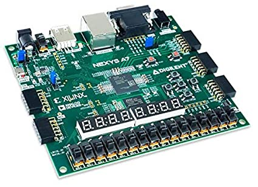

# lab01- BCD2SSEG
laboratorio 02 implementación

En esta plantilla debe adicionar la documentación del laboratorio

* Humberto Sebastián Córrdoba Torres
* Nikolai Alexander Caceres Penagos
* Esteban Ladino Fajardo

Este es la prueba de la tutoria del 14 de abril de 2020

insertar imagen 

